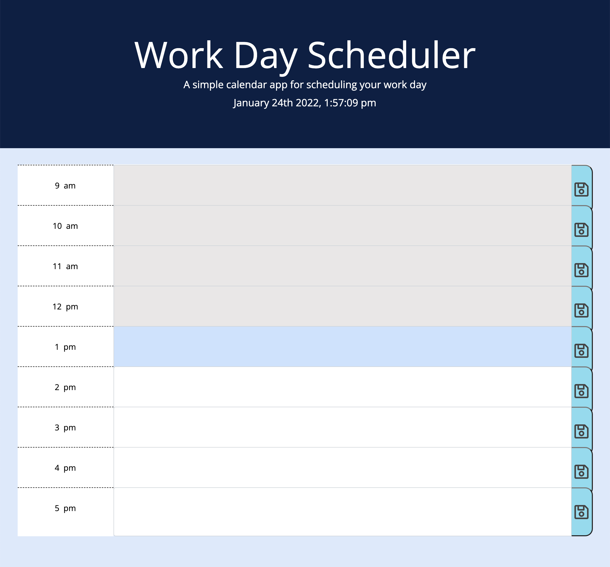

# Work Day Scheduler

 Application live URL:  https://houst29476.github.io/workday-scheduler/

 GitHub Repository URL: https://github.com/Houst29476/workday-scheduler

 Create a Workday daily planner that a user can add important events to help the user with a busy schedule manage their time more effectively:

	Functionality Requirements:

    •	Create daily planner to create a schedule:
        -	When opened, current day is displayed at the top of calendar.

    •	When the user scrolls down:
        -	User presented with (hour) time blocks for standard business hours

    •	When viewing (hour) time blocks for each day:
        -	User presented with time block is color-coded to indicate whether it is in the past, present, or future

    •	When user clicks into a time block:
        -	User can enter an event

    •	When user clicks SAVE for specific time block:
        -	Text for event entered is saved in local storage

    •	When the page is refreshed:
        -	Saved events persist

Pseudo Code
- Display Current Time
- Create Local storage function for entered events
- Time (hour) blocks need to change color according to time
- Create function (save button) that saves entered events

